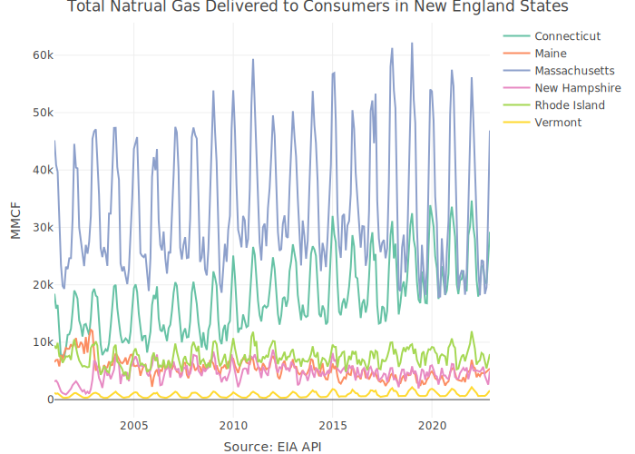

<!-- README.md is generated from README.Rmd. Please edit that file -->

```{r, include = FALSE}
knitr::opts_chunk$set(
  fig.height=5, fig.width=8, 
  message=FALSE, warning=FALSE,
  collapse = TRUE,
  comment = "#>",
  fig.path = "man/figures/README-",
  out.width = "100%")
```

# USgas <a href='https://ramikrispin.github.io/USgas/'></a>

<!-- badges: start -->
[](https://cran.r-project.org/package=USgas) [](https://lifecycle.r-lib.org/articles/stages.html) [](https://opensource.org/licenses/MIT) [](https://github.com/RamiKrispin/USgas/commit/main)

<!-- badges: end -->

The **USgas** package provides an overview of demand for natural gas in the US in a time-series format. That includes the following dataset:

* `usgas` - The monthly consumption of natural gas in the US/state level by end-use since 1973 for US level and 1989 for state level. It includes the following end-use categories:

   - Commercial Consumption
   - Delivered to Consumers
   - Electric Power Consumption
   - Industrial Consumption
   - Lease and Plant Fuel Consumption
   - Pipeline Fuel Consumption
   - Residential Consumption
   - Vehicle Fuel Consumption

The package also includes the following datasets, from previous release:

* `us_total` - The US annual natural gas consumption by state-level between 1997 and 2019, and aggregate level between 1949 and 2019
* `us_monthly` - The monthly demand for natural gas in the US between 2001 and 2020
* `us_residential` - The US monthly natural gas residential consumption by state and aggregate level between 1989 and 2020

The `us_total`, `us_monthly`, and `us_residential` can be derived out of the `usgas` dataset. Therefore, those datasets in the process of deprication and will be removed in the next release to CRAN.

Data source: The US Energy Information Administration [API](https://www.eia.gov/)

More information about the package datasets available on this [vignette](https://ramikrispin.github.io/USgas/articles/introduction.html).

## Installation

You can install the released version of USgas from [CRAN](https://CRAN.R-project.org) with:

``` r
install.packages("USgas")
```

And the development version from [GitHub](https://github.com/) with:

``` r
# install.packages("devtools")
devtools::install_github("RamiKrispin/USgas")
```
## Example

Let's load the data:

```{r}
data("usgas")

head(usgas)

str(usgas)
```


Plotting the residential consumption of natural gas in the US:
``` r
library(plotly)

us_res <- usgas[which(usgas$state == "U.S." & usgas$process == "Residential Consumption"), ]

plot_ly(data = us_res,
        x = ~ date,
        y = ~ y,
        type = "scatter",
        mode = "line") |>
  layout(title = "US Monthly Residential Consumption",
         yaxis = list(title = "MMCF"),
         xaxis = list(title = "Source: EIA API"))
```

```{r, include = FALSE}
library(plotly)

us_res <- usgas[which(usgas$state == "U.S." & usgas$process == "Residential Consumption"), ]

p1 <- plot_ly(data = us_res,
        x = ~ date,
        y = ~ y,
        type = "scatter",
        mode = "line") |>
  layout(title = "US Monthly Natural Gas Consumption by Residential Consumers",
         yaxis = list(title = "MMCF"),
         xaxis = list(title = "Source: EIA API"))
orca(p1, "man/figures/us_res.svg")
```


Plotting the total monthly natural gas delivered in the New England states:

```r
ne <- c("Connecticut", "Maine", "Massachusetts",
        "New Hampshire", "Rhode Island", "Vermont")
ne_gas <-  usgas[which(usgas$state %in% ne & usgas$process == "Delivered to Consumers"),]

plot_ly(data = ne_gas,
        x = ~ date,
        y = ~ y,
        color = ~ state,
        type = "scatter",
        mode = "line") |>
  layout(title = "Total Natrual Gas Delivered to Consumers in New England States",
         yaxis = list(title = "MMCF"),
         xaxis = list(title = "Source: EIA API"))
```

```{r , include = FALSE}
ne <- c("Connecticut", "Maine", "Massachusetts",
        "New Hampshire", "Rhode Island", "Vermont")
ne_gas <-  usgas[which(usgas$state %in% ne & usgas$process == "Delivered to Consumers"),]

p2 <- plot_ly(data = ne_gas,
        x = ~ date,
        y = ~ y,
        color = ~ state,
        type = "scatter",
        mode = "line") |>
  layout(title = "Total Natrual Gas Delivered to Consumers in New England States",
         yaxis = list(title = "MMCF"),
         xaxis = list(title = "Source: EIA API"))

orca(p2, "man/figures/new_england.svg")
```


